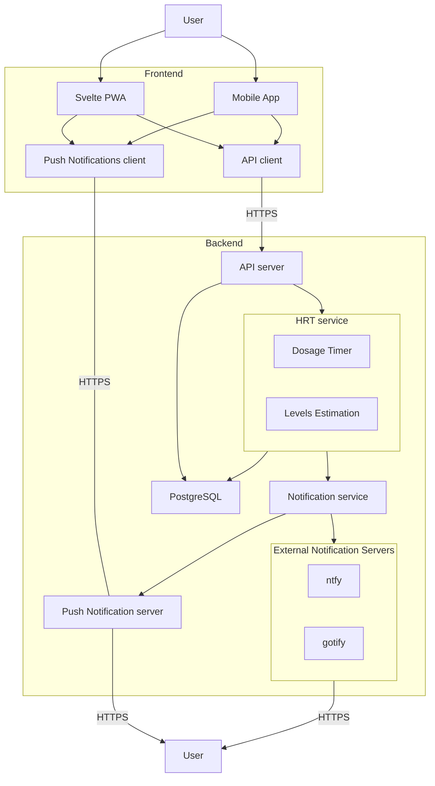

# hrtclicker v2 Design Document

## Summary

This design document plans out the process of rewriting hrtclicker from its
current architecture to one that is more suitable as a publicly available
service.

## Motivation

Originally, hrtclicker was written as a personal self-hosted tool intended to
help Diamond keep track of when it needs to apply its estrogen patches.
However, as time went on, more people expressed interest in using the tool for
tracking their own hormone schedules.

The current architecture of hrtclicker is not suitable for public use. Its
database is stored in a SQLite file and does not contain any user information,
so it can only store information for one user. The hormone configuration is
also hard-coded in a JSON config, so the tool only supports Diamond's specific
estrogen patch schedule.

This design document outlines the steps needed to rewrite hrtclicker to support
multiple users, each with their own hormone configuration and schedules. It
will also outline all the planned features and categorize them accordingly to
accommodate future plans of turning some of these features into premium
offerings.

## Design

### Architecture

### Features

Features will be divided into various tiers, with tier 1 being the most
essential features that must be free for all users.

#### Tier 1 -- Essential Features

- User registration and per-user data storage
- Support estimating estrogen levels (over time, current and averages) for
  patches and injections
  - Patches should allow for 0.1mg, 0.075mg, and 0.05mg doses
  - Injections should allow for variable doses and ester types
- Customizable notification schedule
  - For patches, account for the fact that multiple patches can be on the body
    at once, but only N patches will be on the body at once.
    - This can change; people can take off patches early or late.
    - Default to every 36h for patches.
  - For injections, default to every 7 days.
- Support for various notification servers with authentication
  - [ntfy](https://ntfy.sh)
  - [gotify](https://gotify.net)

#### Tier 2 -- Eventually Implemented

- PWA support with Push Notifications
  - Setup-free notifications that don't require a notification server
- Support for sublingual estrogen
- OpenAPI schema and server implementation for user and estrogen data
- Allow calibrating the estimated estrogen levels using actual lab results
- Exporting data to CSV

#### Tier 3 -- Nice to Haves

- Native mobile application that supports Android and iOS
  - Ability to operate fully offline without relying on server-sent notifications
  - Periodic sync with the server, reconciling its state when online
- Token generation support for APIs
- Sharing a range of data and/or current levels with other people via a public link
  - Expiring links

#### Tier 4 -- Premium Features

- Override message and timing for next notification
- Prevent notifications from firing during certain hours, forcing them to be
  sent before or after.
- Assign persistent comments to each historic dose

## Alternatives

TODO
